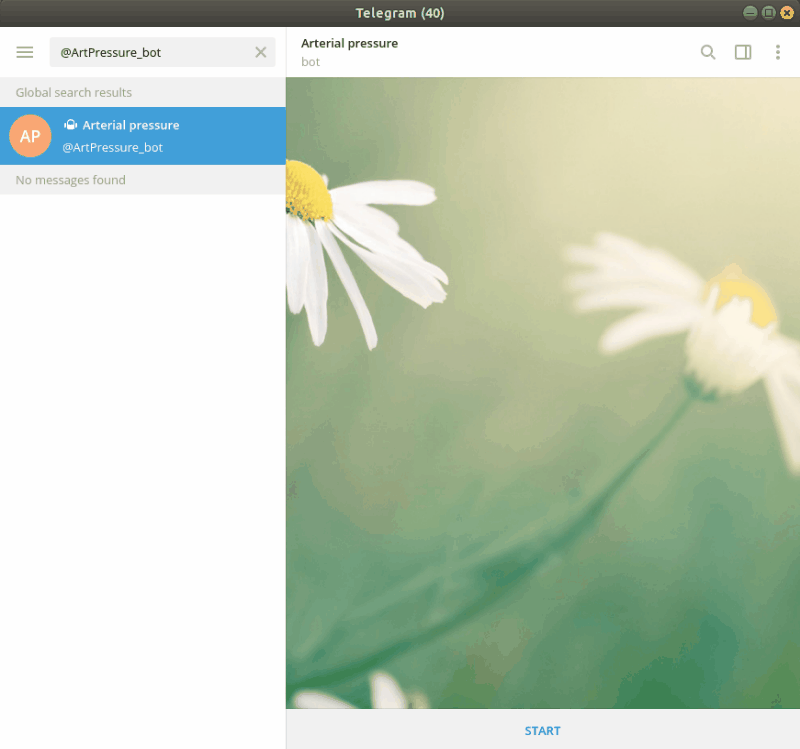

# Telegram Arterial pressure bot. Version 1.0 

### @ArtPressure_bot
#### <https://t.me/ArtPressure_bot>
-------------
Bot which collect your pressure data and makes graphs.
It also remind you when it's time to measure your pressure and
makes recommendation about health

## Usage
-------------
To use the @ArtPressure_bot you need to install telegram first
and connect to the bot.
A full working example on how is works provided in telegram_pressure_bot.py.
Minimum needed moduls are: 
python-telegram-bot==12.0.0b1, psycopg2==2.8.1, matplotlib==3.0.3

## Contributing
-------------
As I use this for my own projects, I know this might not be the perfect approach for all the projects out there. If you have any ideas, just open an issue and tell me what you think.

If you'd like to contribute, please fork the repository and make changes as you'd like. Pull requests are warmly welcome.

## DEMO
-------------

## Licensing
-------------
This project is licensed under BSD-3 license. This license allows unlimited redistribution for any purpose as long as its copyright notices and the license's disclaimers of warranty are maintained. 

## Contacts
-------------
Facebook: <https://www.facebook.com/maria.kuznetsova.1048>

Email: <mari.kuznecova90@gmail.com>
